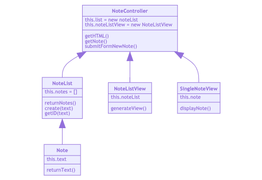

# Notes_App
Writing a frontend, single page app using only pure JavaScript

You'll work in pairs as usual, swapping pairs each day.

You'll build a note-taking app by working through challenges without walkthroughs.

## User Stories
```
As a programmer
I can see a list of my notes, where each note is abbreviated to the first 20 characters
So I can find the one I want
```
```
As a programmer
I can create a new note
So I can record something I need to remember
```
```
As a programmer
I can see the full text of an individual note on its own page
So I can see all the information in the note
```
_(NB: notes do not need to be permanently stored. If the user refreshes their web page, they'll lose their notes, and that's fine.)_

## Domain Model


## How it looks like


## How it works
- Main page has a form to submit a new Note.
- Once submitted it creates a new Note with a text and an ID.
- All the notes are displayed on a list, up to 20 characters.
- If we click in a note from the list, this is displayed on its full length on a new URL that contains the note ID.

## How to run the app
- Fork the repository and clone it to your local.
- Run `index.html` in your browser.
